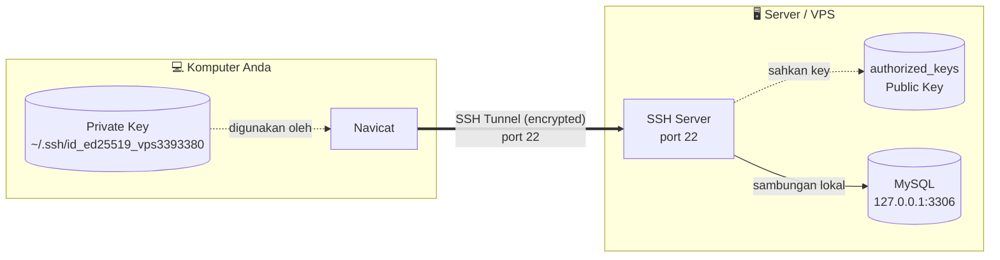
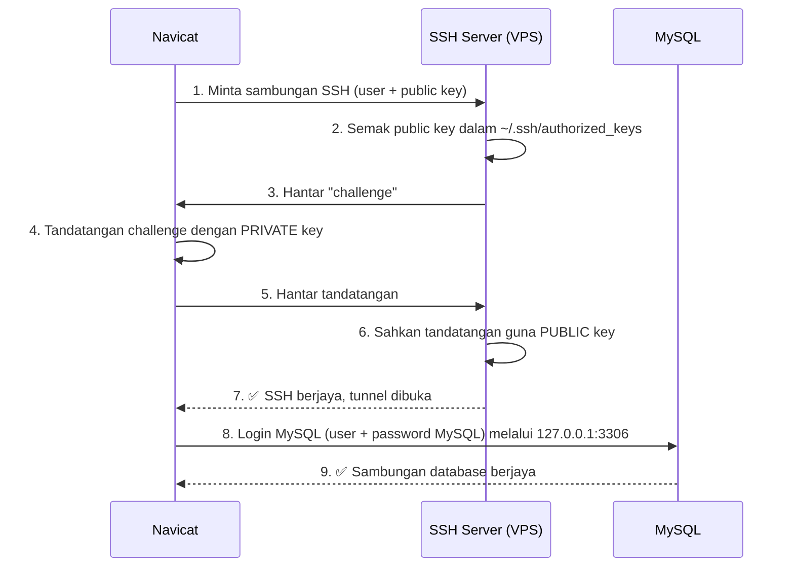
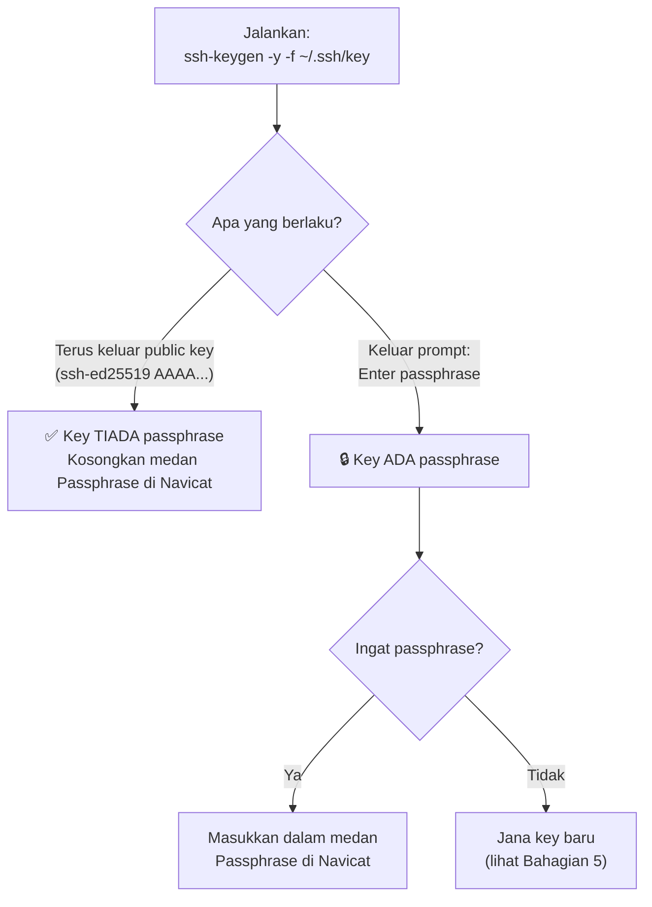
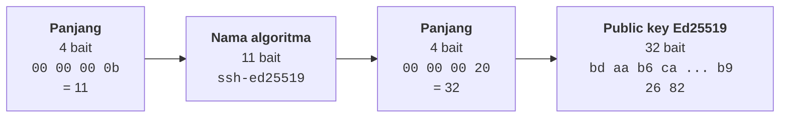
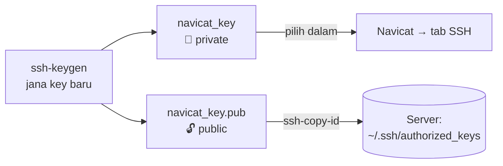

# Sambungan Navicat ke MySQL Server melalui SSH Tunnel (Public Key)

Panduan ini menerangkan cara menyambung **Navicat** ke **MySQL** di server (VPS) menggunakan **SSH tunnel** dengan **SSH key**, iaitu kaedah yang sama seperti log masuk melalui terminal. Panduan ini juga menerangkan cara menyemak sama ada key mempunyai passphrase, dan maksud setiap bahagian dalam output public key.

---

## Kandungan

1. [Konsep: Bagaimana SSH Tunnel Berfungsi](#1-konsep-bagaimana-ssh-tunnel-berfungsi)
2. [Tetapan Navicat](#2-tetapan-navicat)
3. [Semak Passphrase pada Key](#3-semak-passphrase-pada-key)
4. [Penerangan Output Public Key](#4-penerangan-output-public-key)
5. [Jika Passphrase Terlupa](#5-jika-passphrase-terlupa)
6. [Penyelesaian Masalah](#6-penyelesaian-masalah)
7. [Nota Keselamatan](#7-nota-keselamatan)

---

## 1. Konsep: Bagaimana SSH Tunnel Berfungsi

Navicat **tidak** menyambung terus ke port MySQL (3306) dari internet. Navicat log masuk ke server melalui SSH (port 22) terlebih dahulu. Kemudian ia menyambung ke MySQL secara **lokal di dalam server** (`127.0.0.1:3306`).

Dengan cara ini, port MySQL tidak perlu dibuka kepada umum.



### Aliran pengesahan (authentication)



> **Penting:** Terdapat **dua** login yang berasingan:
> - **Login SSH**: guna SSH user + private key
> - **Login MySQL**: guna MySQL user + password MySQL

---

## 2. Tetapan Navicat

Buka **File → New Connection → MySQL**.

### Tab `General`

| Medan | Nilai | Catatan |
|---|---|---|
| Connection Name | `VPS MySQL` (bebas) | Nama paparan sahaja |
| Host | `127.0.0.1` | **Bukan** IP server. Alamat ini dilihat dari dalam server |
| Port | `3306` | Port MySQL |
| User Name | user MySQL | Contoh: `root` atau `app_user` |
| Password | password MySQL | Bukan password SSH |

### Tab `SSH`

| Medan | Nilai | Catatan |
|---|---|---|
| Use SSH Tunnel | ✅ Tanda | |
| Host | IP / domain server | Sama seperti dalam terminal |
| Port | `22` | Atau port SSH custom |
| User Name | user SSH | Sama seperti `ssh user@server` |
| Authentication Method | `Public Key` | |
| Private Key | `~/.ssh/id_ed25519_vps3393380` | Fail **tanpa** `.pub` |
| Passphrase | *(kosongkan)* | Lihat [Bahagian 3](#3-semak-passphrase-pada-key) |

Klik **Test Connection**. Jika berjaya, klik **OK** untuk simpan.

---

## 3. Semak Passphrase pada Key

Jalankan arahan berikut di terminal:

```bash
ssh-keygen -y -f ~/.ssh/id_ed25519_vps3393380
```



### Contoh output

```text
AAAAC3NzaC1lZDI1NTE5AAAAIL2qtspMlbKQwXj+5dVhbUw+3ZbtA7bWhJVxW39TuSaC
```

Output terus dipaparkan tanpa meminta passphrase. Ini bermakna **key ini tiada passphrase**, jadi medan Passphrase di Navicat boleh dibiarkan kosong.

---

## 4. Penerangan Output Public Key

Output lengkap `ssh-keygen -y` mempunyai format **tiga bahagian**:

```text
<jenis-key>  <data-key-base64>  <komen>
```

| Bahagian | Contoh | Maksud |
|---|---|---|
| Jenis key | `ssh-ed25519` | Algoritma key: **Ed25519** (moden, pendek, selamat) |
| Data key | `AAAAC3NzaC1lZDI1NTE5AAAAIL2q...TuSaC` | Public key sebenar dalam format **Base64** |
| Komen | `user@hostname` | Label sahaja untuk kenal pasti key. **Tidak** mempengaruhi keselamatan |

Bahagian yang paling penting ialah **data key Base64**:

```text
AAAAC3NzaC1lZDI1NTE5AAAAIL2qtspMlbKQwXj+5dVhbUw+3ZbtA7bWhJVxW39TuSaC
```

### Struktur dalaman data key

Apabila Base64 ini di-decode, ia menghasilkan **51 bait** data binari dengan struktur berikut:



| Bait | Hex | Maksud |
|---|---|---|
| 0 – 3 | `00 00 00 0b` | Panjang teks seterusnya = **11** bait |
| 4 – 14 | `73 73 68 2d 65 64 32 35 35 31 39` | Teks ASCII **`ssh-ed25519`** |
| 15 – 18 | `00 00 00 20` | Panjang key seterusnya = **32** bait |
| 19 – 50 | `bd aa b6 ca 4c 95 ... 53 b9 26 82` | **Public key Ed25519 sebenar** (32 bait / 256 bit) |

Jumlah: 4 + 11 + 4 + 32 = **51 bait**

### Kenapa semua key Ed25519 bermula dengan `AAAAC3NzaC1lZDI1NTE5`?

Awalan ini ialah Base64 bagi `00 00 00 0b` + `ssh-ed25519`. Bahagian ini **sama untuk setiap key Ed25519**. Begitu juga `AAAAI` yang mewakili panjang `00 00 00 20` (32 bait).

```text
AAAAC3NzaC1lZDI1NTE5 AAAAI L2qtspMlbKQwXj+5dVhbUw+3ZbtA7bWhJVxW39TuSaC
└──────────┬───────┘ └─┬─┘ └────────────────────┬─────────────────────┘
  "ssh-ed25519"     panjang          public key unik anda
  (sama untuk semua) 32 bait         (berbeza bagi setiap key)
```

> Nota: Sempadan Base64 tidak tepat sejajar dengan sempadan bait (setiap 4 aksara Base64 = 3 bait). Oleh itu pembahagian di atas adalah anggaran visual.

### Cara decode sendiri

```bash
echo "AAAAC3NzaC1lZDI1NTE5AAAAIL2qtspMlbKQwXj+5dVhbUw+3ZbtA7bWhJVxW39TuSaC" \
  | base64 -d | od -A d -t x1 -c
```

---

## 5. Jika Passphrase Terlupa

Passphrase **tidak boleh dipulihkan**. Penyelesaiannya ialah jana key baru khas untuk Navicat:

```bash
# 1. Jana key baru (tekan Enter apabila diminta passphrase untuk kosongkan)
ssh-keygen -t rsa -b 4096 -m PEM -f ~/.ssh/navicat_key

# 2. Salin public key ke server (guna akses terminal sedia ada)
ssh-copy-id -i ~/.ssh/navicat_key.pub user@ip-server
```

Kemudian, dalam Navicat, tetapkan **Private Key** kepada `~/.ssh/navicat_key`.



Key lama masih berfungsi seperti biasa untuk terminal.

---

## 6. Penyelesaian Masalah

| Ralat | Punca | Penyelesaian |
|---|---|---|
| `Invalid private key` / format key tidak disokong | Navicat versi lama tidak menyokong **Ed25519** atau format OpenSSH baru | Kemas kini Navicat, **atau** jana key RSA format PEM (Bahagian 5) |
| `Access denied for user` | SSH berjaya, tetapi user MySQL tidak dibenarkan dari `localhost` | Semak `SELECT user, host FROM mysql.user;` dan pastikan ada `'user'@'localhost'` atau `'user'@'127.0.0.1'` |
| `Can't connect to MySQL server` | MySQL tidak mendengar di `127.0.0.1:3306` | Semak di server: `sudo ss -tlnp \| grep 3306` |
| MySQL dalam **Docker** | Port container tidak di-publish ke host | Publish port (`-p 127.0.0.1:3306:3306`) atau guna IP container sebagai Host |
| `Permission denied (publickey)` | SSH user / key salah | Uji dulu di terminal: `ssh -i ~/.ssh/key user@ip-server` |

---

## 7. Nota Keselamatan

| Fail | Boleh dikongsi? | Catatan |
|---|---|---|
| `id_ed25519_vps3393380.pub` (public key) | ✅ Ya | Selamat diletak di server / GitHub / dikongsi |
| `id_ed25519_vps3393380` (private key) | ❌ **TIDAK** | Jangan sesekali hantar, commit ke Git, atau kongsi |

- Key **tanpa passphrase** lebih mudah digunakan. Namun sesiapa yang mendapat fail private key boleh terus log masuk ke server. Simpan fail ini dengan selamat.
- Pastikan kebenaran fail betul: `chmod 600 ~/.ssh/id_ed25519_vps3393380`
- Sebaik-baiknya, jangan buka port MySQL `3306` kepada umum di firewall. Guna SSH tunnel sahaja.